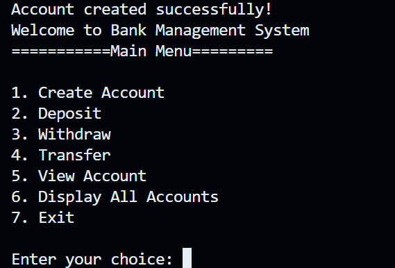

# Bank-Management-System

A simple Bank Management System built with Java to practice Object-Oriented Programming (OOP).

## Features
- Create Account
- View Account
- Deposit
- Withdraw
- Transfer

## Technologies
- Java
- OOP
- ArrayList 
- Scanner

## Project Structure
- **MainConsole.java** - Handles user interaction and menu navigation.
- **Bank.java** - Manages all bank accounts and banking operations.
- **Account.java** - Represents a bank account and its behaviors.

## Requirements
- Java JDK 17 or above
- Any Java IDE (VS Code, IntelliJ IDEA)

## How to Run
1. Clone or download this repository.
2. Open the project in IDE (VS Code or IntelliJ IDEA)
3. Run 'MainConsole.java'.
4. Follow the menu shown in the console

## Learning Objectives
- Practice Java OOP
- Understand the process of developing a project
- Learn Git and GitHub Workflow

## Future Improvements
- Transaction history
- Input validation

